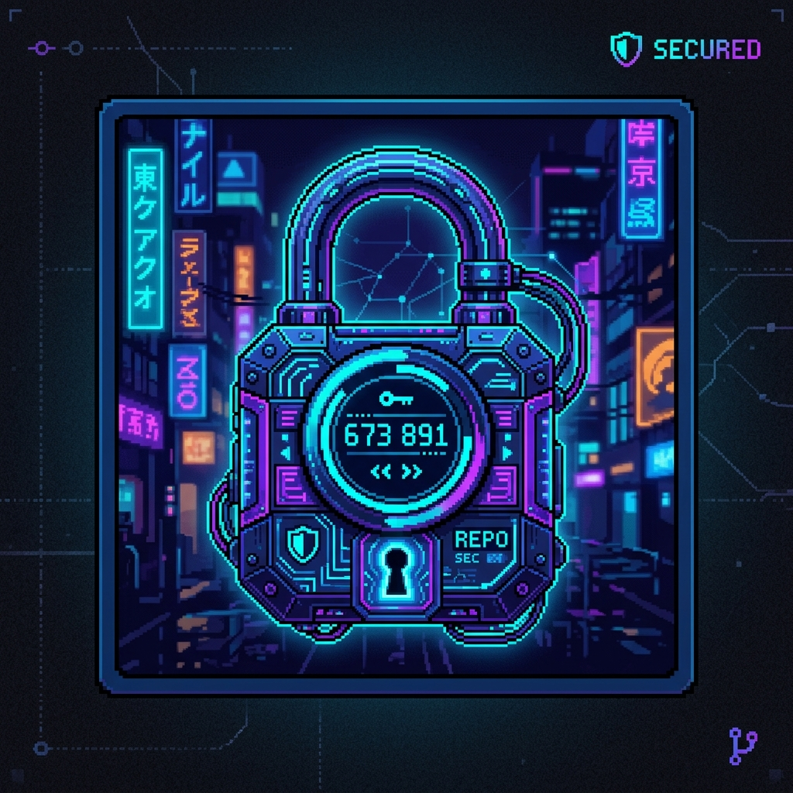

<div align="center">
  
  <br>
  
</div>

# Libre OTP Authenticator

Native Rust OTP authenticator designed for PAM integration without proprietary backends. Supports SSH auth, boot, login, and YubiKey.

## Overview
This standalone application provides comprehensive libre otp authenticator capabilities for Arch Linux, natively integrated with Wayland/Xorg via `egui` and providing strict CLI parity via `clap`.

## Build Instructions
Ensure you have the Rust toolchain installed:
```bash
# Install rustup
pacman -S rustup
rustup default stable
```

Clone the repository and build:
```bash
git clone https://github.com/tilas01/arch-guides-dynamic.git
cd arch-guides-dynamic/security-tools/libre-otp
cargo build --release
```

## Usage
The application can be run as a daemon or launched interactively via the GUI dashboard.

**Daemon Mode:**
```bash
./target/release/libre-otp
```

**Interactive Dashboard (GUI):**
```bash
./target/release/libre-otp --interactive
# or
./target/release/libre-otp -i
```

**Help Menu:**
```bash
./target/release/libre-otp --help
```

## Advanced Integration (PAM)
Libre-OTP can be integrated directly into your PAM stack for SSH authentication, boot decryption, or local login.

**SSH Integration:**
Add the PAM module to `/etc/pam.d/sshd`:
```text
auth required pam_libre_otp.so
```

**YubiKey Hardware Key:**
Libre-OTP fully supports YubiKey hardware tokens for HMAC-SHA1 Challenge-Response. Enable this via the GUI dashboard.


## Cryptographic Memory Hygiene

To prevent cold boot attacks, memory scraping, and privilege escalation vulnerabilities, this tool employs strict cryptographic memory hygiene. All sensitive data (passwords, PINs, cryptographic seeds, and TOTP secrets) are handled via the `zeroize` crate.

As soon as a sensitive variable falls out of scope or is no longer immediately required for verification, its memory address is explicitly overwritten with zeroes. This guarantees that your secrets do not linger in RAM.
